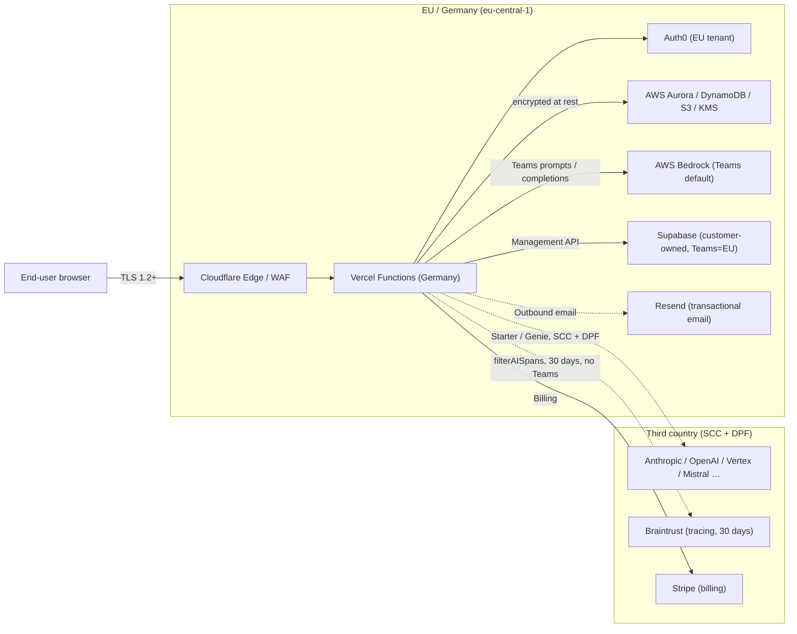

Audience: customers, their procurement teams, and their data protection officers (DPOs).

We hand out this package when a customer requests the DPA, the documented technical and organizational measures (TOMs), the list of subprocessors, the data protection / deletion concept, and our processes for fulfilling data subject rights.

We maintain an internal evidence package aligned to ISO 27001 controls (Annex A); we do not currently hold ISO certification. The package is available on request. Both language versions are kept in sync.

<Note>
  **Separate annex documents.** The following content is also available as standalone annexes that can be sent independently — suited for procurement, DPO, or audit processes that only need to review one aspect:

  - [Annex A — List of subprocessors](/compliance/subprocessors) (corresponds to §4)
  - [Annex B — Technical and organizational measures (TOMs)](/compliance/tom) (corresponds to §6 + §7)
  - [Annex C — AI Data Processing Addendum](/compliance/ai-dpa) (bundles §1.1, the §4 default path, §5.4, §5.6)

  The annexes are kept in sync with this main document.
</Note>

<Note>
  **Note:** the legal-entity fields in §0 are currently marked `[TBD]` and are filled in before this package is sent to a specific customer. Please verify before sharing.
</Note>

**Table of contents:**

0. About us — legal entity and controller
1. Role model — controller and processor
2. Data Processing Agreement (DPA) — template
3. High-level architecture and data flows
4. Subprocessors — who we use and for what
5. Data processed, data subjects, purposes
6. Technical measures (TOMs under Art. 32 GDPR)
7. Organizational measures
8. Data protection and deletion concept
9. Fulfillment of data subject rights
10. How we ensure deletion actually happens
11. Contacts and change notifications

---

## 0. About us — legal entity and controller

- **Full legal entity name:** `[TBD]`
- **Address:** `[TBD]`
- **Authorized representatives:** `[TBD]`
- **Commercial register:** `[TBD — HRB / local court]`
- **VAT ID:** `[TBD]`
- **Data protection officer:** Claire Fahmy (`privacy@genie-app.de`)
- **EU representative (Art. 27 GDPR):** not required — EU-based entity
- **Primary security / privacy contact:** `privacy@genie-app.de` / `security@genie-app.de`

---

## 1. Role model — controller and processor

Genie processes personal data in several clearly separated roles:

- **Processor within the meaning of Art. 28 GDPR** — for data that arises directly from the Genie services (identity and profile data, chat and project content, customer-side configuration, instruction-bound operational processing). The controller within the meaning of Art. 4(7) GDPR is the customer. See §2 (DPA) for the legal basis and obligations.
- **Genie's own controllership for limited purposes.** To the extent Genie processes personal data to meet its own statutory obligations, for billing, to ensure the security and integrity of the platform, to prevent abuse, or to enforce its own legal claims, it does so as controller under Art. 4(7) GDPR. This applies in particular to tax and commercial-law retention obligations, security and audit logs, incident response processes, abuse detection, and compliance / evidentiary obligations. The respective legal bases are documented in §5.3.
- **Customer-owned Supabase projects — instruction-bound processing.** Genie does not, as a rule, process the content of customer-owned Supabase projects for its own purposes and acts exclusively on instruction in this respect. The customer remains the controller within the meaning of Art. 4(7) GDPR. Genie holds only management API credentials and has no operational visibility into the content of these databases. Where technical administration or support access is required, it takes place only on the controller's documented instruction or for contract performance; it is access-logged (§6.1, §7.6) and subject to the four-eyes principle under §7.7.

### 1.1 Shared responsibility — division between customer and Genie

Genie provides the platform and the underlying processing functions. **The customer remains responsible for the lawfulness of the content, data categories, and processing purposes it introduces into its projects.** This includes in particular:

- content and data categories the customer processes via prompts, uploads, its own data models, or edge functions;
- the selection and configuration of optional LLM providers within the respective workspace (§4);
- data flows between the customer's own edge functions and third-party systems;
- assessing whether the given processing requires a DPIA (§5.6) or the data subjects' explicit consent;
- informing its own end users under Art. 13 / 14 GDPR.

Genie supports the customer in meeting this responsibility through documented configuration options, this compliance package, and additional information on request.

---

## 2. Data Processing Agreement (DPA) — template

We provide our standard DPA as a countersigned PDF on request to `privacy@genie-app.de`. The template below matches that PDF in substance and can be reviewed in advance by the customer's DPO.

<Warning>
  **Template — not a signed contract.** A binding DPA only comes into effect once countersigned. Please send requests to `privacy@genie-app.de` with the legal entity name, contact person, and the intended data categories; we return the countersigned PDF within 5 business days.
</Warning>

### 2.1 Parties

- **Controller**: the customer named in the Genie order form.
- **Processor**: the Genie entity named in the Genie order form (see §0).

### 2.2 Subject matter and duration of processing

Processing of personal data for the purpose of providing the Genie service as set out in the order form. The DPA runs for the term of the underlying main contract and ends with the deletion of customer data under §8.

### 2.3 Nature and purpose of the processing

Operation of a hosted application development platform: identity, project hosting, LLM-assisted code generation, deployment to a customer-owned Supabase project, observability, and customer support. Processing for which Genie is itself the controller (in particular billing, tax and commercial-law retention, security and audit logs, incident response, abuse prevention) is not the subject of this DPA; see §1 and §5.3.

### 2.4 Types of personal data and categories of data subjects

See §5 of this document; this section is incorporated into the DPA by reference.

### 2.5 Processor obligations

The processor:

- processes personal data only on the controller's documented instruction (the order form, this DPA, and tickets via `privacy@genie-app.de` count as documented instructions);
- binds everyone authorized to process data to confidentiality;
- implements the TOMs under §6 and keeps them current;
- engages subprocessors only as set out in §4 and gives at least **30 days'** notice before adding or replacing one (right to object under Art. 28(2) GDPR);
- supports the controller in fulfilling data subject rights under §9;
- supports the controller with security incidents, DPIAs, and prior consultation under Art. 28(3)(f) GDPR;
- deletes or, at the controller's choice, returns all personal data at the end of the contract (§8 / §10);
- provides all information necessary to demonstrate compliance and enables audits under §2.7.

### 2.6 Subprocessors

Listed in §4. The list in effect at signing is the agreed baseline; subsequent changes follow the 30-day process above.

### 2.7 Audit rights

The controller may verify compliance with the DPA by:

- reviewing this document and the linked evidence package aligned to ISO 27001 controls;
- requesting our subprocessors' current **SOC 2 Type II** or equivalent audit reports;
- where available, standardized security and privacy questionnaires (e.g. CAIQ, SIG Lite, VSA) and evidence documents (pentest summaries, ISO-27001-aligned evidence package, subprocessor DPAs) on request via `privacy@genie-app.de`;
- once per calendar year, through an on-site or remote audit with at least 30 days' notice, at the controller's expense, during normal business hours and subject to a mutually accepted NDA; ad hoc audits are possible for good cause (e.g. a security incident affecting the customer).

### 2.8 International data transfers

Primary processing takes place in **AWS eu-central-1 (Germany)**. Transfers to subprocessors outside the EU/EEA (e.g. US-based LLM providers) rely on the EU Standard Contractual Clauses (2021/914) and, where applicable, the EU–US Data Privacy Framework.

**Teams accounts / workspaces — EU data residency:** for customers on a Teams plan, processing and storage of personal user data is configured to take place **within the EU**. Where a service offers a German region (e.g. AWS eu-central-1, Germany), that region is used preferentially. LLM inference for Teams users is routed via **AWS Bedrock (eu-central-1)**; under this configuration, prompts and completions are not intended to leave the EU.

### 2.9 Liability and term

Governed by the underlying order form. Termination, governing law, and jurisdiction likewise follow the order form.

---

## 3. High-level architecture and data flows

The following overview describes which components work together to operate the Genie platform and what data flows between them. See §4 for detailed region and compliance information per subprocessor.

| Component | Region | Encryption in transit | Encryption at rest | Third-country mechanism |
| --- | --- | --- | --- | --- |
| Cloudflare (Edge / WAF) | Global edge network, primarily EU PoPs | TLS 1.2+ | n/a | DPA / SCC / DPF where a third-country transfer occurs |
| Vercel Functions | EU (Germany) | TLS 1.2+ | Platform-managed | n/a |
| Auth0 | EU tenant | TLS 1.2+ | Platform-side | n/a |
| AWS Aurora / DynamoDB / S3 / KMS | eu-central-1 (Germany) | TLS 1.2+ | AWS KMS / SSE | n/a |
| AWS Bedrock | eu-central-1 (Germany) | TLS 1.2+ | AWS posture | n/a |
| Supabase (customer-owned) | EU (Germany) for Teams; otherwise customer's choice | TLS 1.2+ | Platform-side | n/a, where EU |
| Resend | EU | TLS 1.2+ | Platform-side | n/a |
| Braintrust | EU region | TLS 1.2+ | Platform-side | SCC, where applicable |
| LLM providers (Anthropic / OpenAI / Vertex / Mistral / xAI / Perplexity / Replicate / Voyage) | EU default (via Bedrock and EU endpoints); US only when Anthropic or OpenAI is used directly (Starter / Genie plans) | TLS 1.2+ | Platform-side | SCC (2021/914), EU–US Data Privacy Framework where available |
| Stripe | EU with US sub-metadata | TLS 1.2+ | PCI scope held by Stripe | SCC for US sub-metadata |

Primary data storage is in **AWS eu-central-1 (Germany)**. For Teams accounts, LLM inference is routed via AWS Bedrock (eu-central-1); under this configuration, prompts and completions are not processed outside the EU.

---

## 4. Subprocessors — who we use and for what

For each listed subprocessor, a signed DPA or Standard Contractual Clauses are in place. The table here reflects the customer-facing view.

### Default path and third-country strategy

Genie processes personal data in the EU by default. For GDPR-sensitive setups — in particular Teams workspaces and larger enterprise customers — the following applies:

- **EU-only default (Teams).** LLM inference for Teams accounts is configured to route via AWS Bedrock (`eu-central-1`, Germany). Under this configuration, prompts and completions are, to our knowledge, not processed outside the EU. The remaining core services (AWS Aurora, S3, DynamoDB, KMS, Auth0, Vercel Functions, Resend, Supabase provisioning) are likewise EU-resident. We recommend this path as the enterprise and GDPR default.
- **Contractual no-training-on-inputs commitments.** Where LLM providers receive live customer data, we hold contractual zero-data-retention / no-training-on-inputs commitments (Anthropic, OpenAI, AWS Bedrock, Google Vertex). These commitments are backed by the respective DPAs and provider statements; auditable evidence (DPA excerpts, provider statements) is available on request via `privacy@genie-app.de`. For Google Vertex, the relevant commitment is publicly documented in the [Google Cloud Data Processing Addendum (CDPA)](https://cloud.google.com/terms/data-processing-addendum), which covers Google Cloud Platform including Vertex AI (as of June 2026).
- **US providers — optional opt-in, not the default.** Anthropic and OpenAI (outside Bedrock), Perplexity, Replicate, Hugging Face, xAI, and optionally Voyage are used only for Starter / Genie plans or after explicit activation by the customer in the project settings. For Teams customers, they are not the default path and can be fully disabled (see "Provider deactivation" below).
- **Third-country transfer basis.** Transfers outside the EU/EEA rely on the EU Standard Contractual Clauses (Modules 2/3, Implementing Decision 2021/914) and, where applicable, the EU–US Data Privacy Framework. For every US provider with access to personal data, we hold an internal **Transfer Impact Assessment (TIA)** under EDPB Recommendations 01/2020. TIAs are updated at least annually and on an ad hoc basis (e.g. following material changes to US surveillance legislation). TIA summaries are available on request.
- **Data minimization for third-country transfers.** Only the prompt and completion data required for inference is transmitted. Stable internal identifiers are, where technically possible, replaced with pseudonyms before transmission; live user identities (email, real name, Auth0 IDs) are, by design, not intended to be part of LLM payloads. Plaintext secrets, MCP credentials, and billing bodies are excluded from payloads by documented filtering and logging rules (§6.1).
- **Provider deactivation.** Customers can disable individual LLM providers in workspace settings. Teams customers can restrict the provider scope to "EU-only / AWS Bedrock"; in this configuration, requests to US providers are technically blocked. A central overview of active providers per workspace is available in admin settings.

### Subprocessors in use

The following services are directly involved in operating the Genie platform and customer apps. They process end users' personal data.

| # | Subprocessor | What they do for us | Data categories | Region | Compliance |
| --- | --- | --- | --- | --- | --- |
| 1 | **Auth0 (Okta)** | Federated identity, OIDC sign-in (password / social / SSO). We never see or store the password. | Email, name, Auth0 user ID, sign-in IP, MFA factors | EU | SOC 2 Type II, ISO 27001 |
| 2 | **Stripe** | Subscription billing, payment methods, invoices, tax. PCI scope sits entirely with Stripe; we never see the PAN. | Name, email, billing address, payment-method token, invoice line items | EU | PCI DSS L1, SOC 1/2 |
| 3 | **Braintrust** | LLM observability — traces, evals, prompt versions. 30-day retention. Only AI-related spans are exported (`filterAISpans`). **Teams workspaces are automatically excluded from trace export** (see §5.4). | Prompts, completions, traces | EU | SOC 2 Type II |
| 4 | **AWS** (Aurora Postgres, S3, DynamoDB, Lambda, CloudFront, KMS, Secrets Manager, CodeBuild) | Primary application infrastructure: relational DB, object storage, key-value store, CDN, secret storage, build runner. | All application data; encrypted customer secrets | eu-central-1 (Germany) | ISO 27001, SOC 1/2/3, C5, FedRAMP |
| 5 | **Supabase** | Per-customer Postgres + edge functions for the customer's own app. We hold only management API credentials. **Teams workspaces are provisioned in the EU (Germany) by default.** | Whatever the customer feeds into its app | EU (Germany) for Teams; otherwise customer's choice | SOC 2 Type II |
| 6 | **Cloudflare** | CDN, WAF, DNS, custom-hostname routing, worker for tenant routing. Cloudflare processes request metadata and security events (WAF events) in particular to provide CDN, DNS, and WAF functionality. Edge termination happens primarily at EU PoPs. A DPA and EU SCCs are in place; Cloudflare's EU Data Boundary is used where applicable to our services. | TLS traffic, request metadata, IP, custom hostnames, WAF security events | Global edge network, primarily EU PoPs | ISO 27001, SOC 2 |
| 7 | **Vercel** | Hosting of the Genie web application, OpenTelemetry bridge. Request routing happens automatically to the nearest server; serverless functions run in Germany. | Request metadata, telemetry, build logs | EU (Germany) | SOC 2 Type II |
| 8 | **Anthropic** | LLM inference for Genie agent features and the LLM proxy (Starter / Genie plans). Contractual zero-retention commitment. **Teams users are routed via AWS Bedrock (eu-central-1) on the default path; direct data transmission to Anthropic is not intended under this configuration.** | Prompts and completions | US (SCC) — Starter / Genie plans only | SOC 2 Type II |
| 9 | **AWS Bedrock** | LLM inference routed through our AWS account. **Default LLM provider for all Teams users** — the region configuration is designed so prompts and completions are processed within the EU. | Prompts and completions | eu-central-1 (Germany) | Inherits AWS posture |
| 10 | **OpenAI** | LLM inference for non-Teams accounts. Contractual zero-data-retention commitment. | Prompts and completions | US (SCC) — Starter / Genie plans only | SOC 2 Type II |
| 11 | **Google Vertex AI** | Optional LLM provider (Gemini) and embeddings. Processed under the [Google Cloud Data Processing Addendum (CDPA)](https://cloud.google.com/terms/data-processing-addendum). | Prompts and completions | EU region available | ISO 27001, SOC 1/2/3 |
| 12 | **Mistral / xAI / Replicate / Voyage / Perplexity** | Optional LLM and embedding providers, selectable per project. | Prompts, completions, embeddings | Per provider; SCC for third countries | SOC 2 (respectively) |
| 13 | **Resend** | Transactional email (proxy for customer edge functions). | Recipient address, subject, and content | EU | SOC 2 Type II |
| 14 | **Hugging Face** | Inference proxy target for customer ML features. Only activated when the user explicitly configures it. | Prompts / inputs from customer edge functions | US (SCC); EU endpoint where available | SOC 2 Type II |

---

## 5. Data processed, data subjects, purposes

Part of the DPA (§2.4).

### 5.1 Categories of data subjects

- **End users** of the customer account (natural persons who sign in to Genie).
- **Recipients of emails** the customer sends via its edge functions through the Resend proxy.
- **Visitors** to customer-hosted applications (only to the extent the customer collects their data in its own Supabase project — this data is not visible to Genie, see §1).

### 5.2 Categories of personal data

| Category | Examples | Storage location |
| --- | --- | --- |
| Identity & profile | Email, display name, avatar URL | AWS; Auth0 |
| Authentication metadata | Sign-in IP, MFA factors, last login | Auth0 |
| Billing | Name, billing address, payment-method token, invoices, tax ID | Stripe; AWS |
| User-generated content | Chat messages, prompts, file uploads, generated source code, project metadata | AWS |
| Personalization data (Workspace AI) | Per-user preferences and remembered facts inferred from chat activity, used to tailor Workspace AI suggestions within the customer's own workspace (see [User memory](/workspaces/mcp-api#user-memory)) | AWS |
| Operational telemetry | Error messages, timings, LLM traces, request logs | AWS; Braintrust (30 days) |
| Push & notifications | Web push endpoints, subscription metadata | AWS |
| Audit trail | Workspace activity log: who did what, when | AWS (append-only) |
| Customer-supplied secrets | MCP credentials, API keys | AWS (encrypted) |
| Outbound email recipient data | Recipient address, subject, content | Resend (transactional) |
| LLM payloads | Prompts and completions from Genie features and customer edge functions | The LLM provider chosen for the project (see §4) |

Genie is not designed to process special categories of personal data under Art. 9 GDPR. Customers are instructed to process such data only after their own legal assessment and only in configurations designed for it. Where customers introduce such data into their prompts, uploads, or customer-owned Supabase projects, that processing is their responsibility (§1, §1.1).

### 5.3 Purposes and legal bases

Where Genie acts as processor, the customer determines the legal basis. The table below additionally describes typical purposes as well as processing for which Genie is itself the controller (cf. §1).

The legitimate-interest balancing assessments for processing based on Art. 6(1)(f) GDPR are documented internally and made available on request as part of DPA onboarding.

| Purpose | Legal basis |
| --- | --- |
| Providing the Genie service as set out in the order form | Art. 6(1)(b) GDPR (contract performance) |
| Identity, authentication, and access control | Art. 6(1)(b) GDPR; additionally Art. 6(1)(f) GDPR (account security) |
| LLM-assisted code generation and chat | Art. 6(1)(b) GDPR (contract performance) |
| Deployment and operation of customer-owned applications on Supabase | Art. 6(1)(b) GDPR (contract performance) |
| Billing | Art. 6(1)(b) GDPR (contract performance) |
| Tax and commercial-law retention (invoices, tax data) | Art. 6(1)(c) GDPR (legal obligation; §§ 147 AO, 257 HGB) |
| Operational telemetry / error diagnostics | Art. 6(1)(f) GDPR (legitimate interest in service availability and quality) |
| AI traces / LLM observability (Braintrust, §5.4) | Art. 6(1)(f) GDPR (legitimate interest in the stable operation and security of AI features) |
| Security monitoring and abuse prevention | Art. 6(1)(f) GDPR (legitimate interest in integrity and availability, Recital 49 GDPR) |
| Audit trail / workspace activity log | Art. 6(1)(f) GDPR (legitimate interest in traceability and abuse prevention) |
| Incident response, forensic analysis | Art. 6(1)(f) GDPR; additionally Art. 6(1)(c) GDPR (cooperation duties under Art. 33 / 34 GDPR) |
| Fulfillment of data subject rights (§9) | Art. 6(1)(c) GDPR (legal obligation under Art. 12 ff. GDPR) |
| Optional features anchored in consent (e.g. explicitly activated providers, marketing emails) | Art. 6(1)(a) GDPR (consent; revocable under Art. 7(3) GDPR) |
| Workspace AI personalization (remembered preferences, per-user embeddings) | Art. 6(1)(b) GDPR (contract performance — providing the personalized Workspace AI feature as part of the Genie service) |

### 5.4 Handling of LLM data

- **Model training.** We do not use live customer data for model training. Where our LLM providers have made contractual zero-data-retention / no-training-on-inputs commitments (Anthropic, OpenAI, AWS Bedrock, Google Vertex), these commitments are documented in the respective DPAs / provider statements; auditable excerpts are available on request. For Google Vertex, this commitment is publicly available in the [Google Cloud Data Processing Addendum (CDPA)](https://cloud.google.com/terms/data-processing-addendum), which covers Vertex AI (as of June 2026). For Teams plans, inference is configured to run via AWS Bedrock (`eu-central-1`); direct data flow to Anthropic or OpenAI is not intended under this configuration.
- **Prompt leakage prevention.** Prompt context is strictly scoped to the respective user and their project; there is no cross-project processing in a shared LLM session. Database access is secured through row-level security and user-scoped application contexts (see §6.1).
- **Embeddings.** Genie's own infrastructure persists embeddings for one disclosed purpose: Workspace AI's per-user personalization features (remembered preferences and free-form memories, see [User memory](/workspaces/mcp-api#user-memory)) store an embedding per record to support similarity search and de-duplication, scoped to that user via row-level security. Customers can view or delete this data via the `search_user_memory` / `forget_user_memory` tools, or as part of account deletion (§8.3). Where customers separately generate or store embeddings via edge functions in their own Supabase project, that storage is the customer's responsibility (see §1).
- **LLM traces (Braintrust).**
  - **Purpose.** Quality monitoring, regression detection, and debugging of LLM-assisted features. Not used for profiling, marketing, or training purposes.
  - **Teams exclusion.** Workspaces on a Teams plan are technically configured to be excluded from trace export to Braintrust. Spans from Teams workspaces are not transmitted to Braintrust under this configuration; the configuration is documented in code and subject to mandatory code review (§6.2).
  - **Data minimization.** For all other plans, only AI-related spans are exported (`filterAISpans`); general application or request logs, plaintext secrets, MCP credentials, and billing bodies are excluded by documented filter rules. Stable internal identifiers are pseudonymized before transmission.
  - **Purpose limitation and retention.** Traces are processed only for the purposes listed above; 30-day retention, followed by automated deletion.
  - **Legal basis.** Art. 6(1)(f) GDPR (legitimate interest in the stable operation and security of AI features; balancing assessment documented, §5.3).
  - **Access restriction.** Access to traces is limited to people with documented production access, MFA-protected, role-based (§7.7), and fully logged (§6.1, §7.6).
  - **Third country.** Braintrust is operated in the EU region; Standard Contractual Clauses are in place where applicable to individual sub-components.
- **Provider deactivation.** Optional LLM providers (Mistral, xAI, Replicate, Voyage, Perplexity, Hugging Face) are only activated when the customer explicitly configures them in its project settings.

### 5.5 Data protection principles (Art. 5 and Art. 25 GDPR)

Genie implements the principles of Art. 5 GDPR in the platform's design:

- **Data minimization (Art. 5(1)(c) GDPR).** Only the data categories required for the given purpose are collected (§5.2). Sensitive fields (plaintext secrets, MCP credentials, billing bodies, PII) are excluded from logs, telemetry, and LLM traces by documented filter and logging rules (§6.1, §5.4). Identifiers are pseudonymized for third-country transfers (§4 default path).
- **Purpose limitation (Art. 5(1)(b) GDPR).** Processing purposes and their legal bases are documented in §5.3. There is no further processing for incompatible purposes; in particular, live customer data is not used for training, profiling, or marketing purposes.
- **Storage limitation (Art. 5(1)(e) GDPR).** Retention periods defined per category (§8.2) are technically enforced: TTLs on transient state, workflow-driven deletion (§10.1), time-limited backup retention.
- **Integrity and confidentiality (Art. 5(1)(f) GDPR).** Encryption in transit and at rest, signed tokens, signed webhooks, and append-only audit logs (§6.1, §6.2).
- **Accountability (Art. 5(2) GDPR).** This package, the evidence package under §2.7, and the data inventory under §10.3 are the central evidentiary instruments.
- **Privacy by design and by default (Art. 25 GDPR).** Data protection requirements are embedded in standard development and review processes (§6.2 change management). New storage locations or subprocessors are only added via the data-inventory intake control under §10.3, which defines purpose, legal basis, retention, and third-country status among other things. Default settings are privacy-friendly (EU routing enabled, optional providers disabled).
- **Need-to-know.** Access to live customer data is strictly role-based and case-by-case (§7.6, §7.7).
- **Minimal retention.** The shorter period applies in case of doubt; statutory retention obligations (tax, HGB) are excepted.

### 5.6 Data Protection Impact Assessment (Art. 35 GDPR)

There is no general obligation on the processor to carry out a Data Protection Impact Assessment (DPIA) under Art. 35 GDPR; the DPIA obligation falls on the respective controller. Genie supports the controller in preparing and maintaining its DPIA by:

- providing the data categories, processing purposes, legal bases, and TOMs documented in this package,
- providing further detailed information on request (e.g. specific LLM provider configuration, third-country transfer mechanisms, subprocessor compliance reports, TIA summaries).

Internally, we perform a **risk-based assessment of potentially DPIA-relevant processing operations** on an ad hoc basis and at least annually. This assessment covers in particular LLM-assisted features, subprocessor changes involving third countries, and material changes to processing purposes or data categories. Assessments are documented and form part of the internal evidence package.

---

## 6. Technical measures (TOMs, Art. 32 GDPR)

Documented under Art. 32 GDPR. We have implemented technical and organizational measures to ensure the confidentiality, integrity, availability, and resilience of the processing systems and services.

### 6.1 Confidentiality (Art. 32(1)(b))

| Measure | Implementation |
| --- | --- |
| **Access control — identity** | Federated identity via Auth0 (OIDC). Authentication tokens are cryptographically signed; the signature is verified server-side before every session decision. No passwords are stored in the application. |
| **Access control — authorization** | Row-level security at the database level. Every request runs in a user-scoped context; policies determine data visibility. |
| **Least privilege — engineers** | Production access is granted on a role basis and reviewed at least quarterly. Changes to security-relevant code paths require documented sign-off from a second person. |
| **Least privilege — infrastructure** | AWS IAM roles scoped per service; secrets held exclusively in Secrets Manager. |
| **Encryption in transit** | TLS 1.2+ terminated at the Cloudflare / AWS edge. HSTS enabled. |
| **Encryption at rest — infrastructure** | All databases and storage services are encrypted at rest (AWS KMS). |
| **Encryption at rest — secrets** | Customer secrets are end-to-end encrypted before storage. Versioned keys enable rotation without downtime; rotated annually. |
| **Secret hygiene in CI** | Automated secret scanning on every code push; push protection enabled on the source-hosting platform. |
| **Logging ban for sensitive fields** | Plaintext secrets, MCP credentials, full billing request bodies, and PII must not be logged. |

### 6.2 Integrity (Art. 32(1)(b))

| Measure | Implementation |
| --- | --- |
| **Append-only audit log** | The workspace activity log is technically protected against subsequent modification or deletion; anonymization only happens via the controlled account-deletion job. |
| **Signed tokens** | Authentication tokens are cryptographically signed; tampering is rejected. |
| **Signed webhooks** | Stripe and Auth0 webhook signatures are verified before every status change. |
| **Change management** | Changes to production-relevant systems require a documented review and sign-off process by a second person. Mandatory automated checks (tests, secret scan, dependency scan) must pass before merge. |

### 6.3 Availability and resilience (Art. 32(1)(b))

| Measure | Implementation |
| --- | --- |
| **Backups** | Aurora point-in-time recovery, 35-day retention. S3 versioning on buckets holding customer content. |
| **Multi-AZ** | Aurora and DynamoDB are Multi-AZ by default in eu-central-1. |
| **DDoS / WAF** | Cloudflare WAF in front of all customer-facing endpoints. |
| **Workflow durability** | Long-running jobs run on a durable workflow runtime that survives host restarts and deploys. |

### 6.4 Recoverability (Art. 32(1)(c))

- Aurora PITR (35 days) is exercised in staging at least quarterly.
- The disaster-recovery runbook lives in the private ops repo; RPO ≤ 5 min, RTO ≤ 4 h for the Genie control plane. Customer-side Supabase projects inherit Supabase's own DR posture.
- Beyond purely technical recovery, the communication and escalation process is described in the Business Continuity Plan (§6.9).

### 6.5 Pseudonymization (Art. 32(1)(a))

- The audit trail is anonymized in place on account deletion — the statutory evidence is retained without storing PII.
- Proof of deletion is kept in pseudonymized form, without retaining the identifier itself.

### 6.6 Regular review (Art. 32(1)(d))

| Measure | Frequency |
| --- | --- |
| Automated tests on every code change | Per commit |
| Dependency vulnerability scan | Per commit |
| Secret scan | Per commit |
| Penetration test | Annually (external) |
| SEV-1 tabletop exercise | Annually |
| Access review | Quarterly |
| Subprocessor / DPA review | Annually |
| Key rotation | Annually or upon suspected compromise |
| Backup-restore exercise | Quarterly |

The effectiveness of the technical and organizational measures is regularly **assessed, documented, and evaluated** as part of these reviews (Art. 32(1)(d) GDPR). Findings feed into the annual TOM review; material deviations are remediated in tracked follow-up actions and documented in the evidence package.

### 6.7 Vulnerability and patch management

- Continuous dependency scanning on every commit (see §6.6); findings are tracked centrally.
- Detected vulnerabilities are classified by criticality using CVSS v3.1, with the following target remediation timeframes:

| Criticality | CVSS range | Target remediation timeframe |
| --- | --- | --- |
| Critical | ≥ 9.0 | ≤ 7 days, prioritized patching |
| High | 7.0 – 8.9 | ≤ 30 days |
| Medium | 4.0 – 6.9 | ≤ 90 days |
| Low | < 4.0 | Bundled into the regular release cycle |

- Out-of-band releases are possible for critical findings; they follow a shortened but still documented review path (see §6.2).
- External penetration test annually (recurring, cf. §6.6); identified findings are handled per the same criticality matrix.

### 6.8 Incident response (Art. 33 / 34 GDPR)

- 24/7 on-call rotation; 30-minute triage SLA.
- Affected customers are notified without undue delay once sufficiently confirmed findings about a reportable incident are available. The controller is responsible for the 72-hour notification deadline to the competent supervisory authority; we provide the information required under Art. 33(3) GDPR without delay.
- The full lifecycle, evidence preservation, and post-mortem cadence are documented internally and made available for audits on request.

### 6.9 Business Continuity Plan

Scope: §6.3 describes technical redundancy, §6.4 technical recoverability. The Business Continuity Plan adds the organizational incident and communication structure.

- **Incident organization.** 24/7 on-call rotation with a defined escalation path (on-call → incident commander → executive sponsor).
- **Communication processes.** Status updates to affected customers via `status.genie-app.de` and email to the registered primary contact. Security-relevant notices additionally via `security@genie-app.de` (see §11).
- **Responsibilities.** The incident commander coordinates technical recovery; the privacy lead assesses notification obligations under Art. 33 / 34 GDPR; the executive sponsor decides on external communication.
- **Exercise.** The annual SEV-1 tabletop exercise (see §6.6) covers both DR and BCP communication processes.

### 6.10 Subprocessor control (Art. 28 GDPR)

See §2.6 / §4: SOC 2 report or equivalent obtained, DPA signed, register reviewed annually, 30 days' notice before adding or replacing a subprocessor.

---

## 7. Organizational measures

In addition to the technical measures in §6, the following organizational measures are implemented.

### 7.1 Security awareness and training

Employees with access to production systems or customer data complete security and privacy training during onboarding, plus regular refreshers. Specialized training (e.g. secure coding) supplements the baseline.

### 7.2 Confidentiality, NDAs, and joiner-mover-leaver

All employees are contractually bound to confidentiality. Onboarding, role changes, and offboarding follow a documented process that governs granting, adjusting, and revoking access rights. Permissions are revoked immediately upon departure.

### 7.3 Asset and endpoint management

Company devices are centrally inventoried and managed. Disk encryption, screen lock, automatic updates, and endpoint protection are mandatory.

### 7.4 Vendor and third-party management

Subprocessors are vetted for privacy and security requirements before use (SOC 2 or ISO 27001 reports, DPA, SCCs where applicable). See §4 for the current list. Annual re-assessment (see §6.6).

### 7.5 Access and password policy, MFA

Identity-based sign-ins go through a central identity provider with enforced multi-factor authentication for all employee accounts and, in particular, for every production access. Password requirements follow recognized standards (NIST SP 800-63B).

### 7.6 Employee access to customer data

Access to live customer data is strictly need-to-know, role-based, MFA-protected, and logged. Break-glass access is technically possible, is documented before or immediately after use, is tracked by the privacy lead, and is reviewed in the quarterly access review (see §6.6). There is no blanket read access to customer data without a documented reason.

### 7.7 Internal authorization and role model

To implement the requirements of Art. 32 GDPR and §6.1 (least privilege), a documented role model is in place. The following roles have clearly delineated permission profiles; assignments are managed centrally in the identity provider, adjusted during onboarding / role changes / offboarding (§7.2), and reviewed in the quarterly access review (§6.6).

| Role | Area of responsibility | Access to live customer data | Approval / four-eyes |
| --- | --- | --- | --- |
| **Engineering** | Development, code reviews, deployments | No direct read access to live content. Write access only through automated pipelines with mandatory code review. | Mandatory peer review for security-relevant paths (§6.2) |
| **Site reliability / SRE** | Operations, monitoring, incident response | Read access to operational metrics and anonymized telemetry. Access to plaintext customer data only via break-glass. | Escalation and approval process for break-glass |
| **Customer support** | Handling customer requests | Access to profile and billing data based on ticket-documented reasons. No generic access to chat content or uploads. | Ticket-based documentation; privacy-lead spot checks |
| **Privacy lead** | DSAR handling, privacy coordination, audit oversight | Read and edit access as part of DSAR handling (§9). | Four-eyes principle for account deletions and bulk exports |
| **Security officer** | Incident investigation, forensic analysis | Case-by-case, documented; full access during an incident per §6.8. | Documentation and reporting duty to management |
| **Break-glass** | Emergency access during critical incidents | Full access for the duration of the incident; time-limited. | Activation requires two-person sign-off (incident commander + privacy/security lead); full session recording; follow-up review in the quarterly access review |
| **Audit / compliance** | Spot checks, evidence-package maintenance | Read access to audit logs, no edit rights. | n/a |

Every permission change (grant, adjustment, revocation) is fully logged in the identity provider and the respective target systems. Production access is continuously captured in a central audit log (§6.2). There is no generic "admin" role with unfiltered data access; full production access is reachable only through the time-limited break-glass role.

---

## 8. Data protection and deletion concept

We delete at three levels of granularity, end-to-end auditable. Production deletions are initiated and completed within the GDPR 30-day deadline, unless statutory retention obligations or backup retention apply (see §8.2 and §10.5).

### 8.1 Inventory — where personal data lives

- **AWS** — primary data store: user profiles, projects, chat messages, uploads, secrets, audit logs, deployment metadata, transient workflow state.
- **Auth0** — authentication data (email, MFA factors, sign-in IP).
- **Stripe** — billing data (name, address, payment-method token, invoices).
- **Supabase** — customer-owned app database (content is the customer's responsibility, see §1).
- **Braintrust** — LLM traces and observability data (30-day retention; Teams workspaces excluded, §5.4).
- **Resend** — transactional email (recipient address, content).

### 8.2 Retention periods

| Category | Retention | Legal basis |
| --- | --- | --- |
| Account profile | Lifetime of the account, then deleted under §8.3 | Required for operation |
| Workspace activity log | Indefinite, **anonymized** on account deletion | Art. 6(1)(f) — audit & abuse prevention |
| Error records | 90 days | Operational debugging |
| Billing data (mirrored from Stripe) | 7 years | Tax / statutory retention (HGB / AO) |
| Application logs / LLM traces (Braintrust) | 30 days | Observability |
| Database backups (AWS PITR) | 35 days | Disaster recovery |
| Customer-supplied secrets | Until the associated project is deleted | Customer property |
| MCP OAuth handshake state | ~10 min TTL | Transient |
| Pending file edits (DynamoDB TTL) | 1 hour | Transient |
| LLM proxy usage records | 90 days | Billing reconciliation; aggregated afterward |

### 8.3 Account deletion (Art. 17 GDPR)

Triggered by the customer in `/account/settings` and confirmed by typing the email address. Orchestration runs as a durable workflow (`deleteAccountWorkflow`) that survives crashes and deploys.

1. **Pre-flight (synchronous).** Verify session, deduplicate repeat requests, create a deletion job with a 14-day lead time.
2. **Deactivation (immediate, reversible).** Block sign-in, set active subscriptions to expire at period end, pause the customer-side database.
3. **14-day grace period.** The customer can cancel in settings.
4. **Irreversible cascade** (in this order):
   - Cancel all running background processes for this user.
   - Fully delete all of the user's projects.
   - Remove stored files and uploads; invalidate the CDN cache.
   - Delete all database records in dependency order; anonymize audit-log entries.
   - Terminate external accounts at Stripe, Supabase, and Auth0.
5. **Audit.** A pseudonymized proof of deletion is stored (no personal identifier).

### 8.4 Project deletion

Same workflow shape, 7-day grace period, scoped to a single project.

### 8.5 Targeted record deletion

Customers can request deletion of specific records (a single uploaded file, a single chat thread, a push subscription) without an account-wide deletion. Requests via `privacy@genie-app.de` or a support ticket.

### 8.6 Propagation to subprocessors

Every external termination call has a documented endpoint and idempotent retry-with-backoff. Failures are surfaced in admin tools. Any external remnants are caught by §10.

### 8.7 Deletion on the controller's documented instruction

Beyond the self-service deletion paths (§8.3 – §8.5), we also carry out deletions on the controller's documented instruction. Such instructions form part of the DPA (§2.5):

- **Intake and identity verification.** Written or ticket-based instruction via `privacy@genie-app.de` from a contact person named in the order form; identity verification per §9.1.
- **Scope variants.**
  - **Tenant / workspace deletion** — full removal of a workspace including all associated projects, uploads, and audit anonymization.
  - **Partial deletion** — targeted removal of specific data categories (e.g. specific uploads, specific chat threads, specific push subscriptions) at the controller's request.
  - **Data-subject-specific deletion** — deletion of all data attributable to a specific data subject on the controller's instruction.
- **Execution.** Via the same durable workflow as self-service deletion (§10.1). Idempotent steps, retry-with-backoff, propagation to subprocessors (§8.6). Four-eyes principle enforced by the privacy lead (§7.7).
- **Support and escalation process.** Receipt is confirmed within 3 business days; processing is tracked by ticket ID. Follow-up questions are coordinated directly with the controller's named contact person.
- **Evidence.** The controller receives written confirmation of completion with pseudonymized proof of deletion (§10.6). On request, we provide a summary of evidence as part of DPA reporting obligations.
- **SLA.** Executed within the GDPR 30-day deadline; faster if the controller shortens the grace period under §8.3, or for a partial deletion.

---

## 9. Fulfillment of data subject rights

| Right (GDPR) | Mechanism | SLA |
| --- | --- | --- |
| **Art. 15 — Access** | Self-service in the app for profile, projects, billing history. Full structured export via `privacy@genie-app.de`. | 30 days |
| **Art. 16 — Rectification** | Profile fields editable in the app. Billing data via the Stripe customer portal. Other fields via `privacy@genie-app.de`. | Profile / billing immediate; ticket-based fields 30 days |
| **Art. 17 — Erasure** | Self-service in `/account/settings` (§8.3). Also available via `privacy@genie-app.de`. | Initiated within 14 days |
| **Art. 18 — Restriction** | Account-wide deactivation blocks sign-in and pauses processing without deletion. | Within 14 days |
| **Art. 20 — Data portability** | Same package as Art. 15, in machine-readable JSON. | 30 days |
| **Art. 21 — Objection** | `privacy@genie-app.de`. | 30 days |
| **Art. 22 — Automated decision-making** | We do not make legally binding decisions on an automated basis. LLM outputs are suggestions and only take effect through a human action. | n/a |
| **Art. 7(3) — Withdrawal of consent** | Consent elements are toggleable in account settings; withdrawal takes effect on save. | Immediate |
| **Complaint to a supervisory authority** | Data subjects may contact their local data protection authority. Lead authority for EU customers: the **Hessian Commissioner for Data Protection and Freedom of Information** (Hessischer Beauftragter für Datenschutz und Informationsfreiheit, Germany). | n/a |

### 9.1 Identity verification before disclosure

Access and deletion requests received outside the app are only answered after verifying control of the registered email address (challenge link) or, for pure billing requests, via a Stripe customer portal session.

### 9.2 Documentation of DSAR handling

The internal DSAR-handling runbook lives in the private ops repo. Every DSAR is documented with a ticket ID, intake date, identity verification, processing steps, systems involved, and completion date. On request, the controller receives a summary of processing status and measures taken.

---

## 10. How we ensure deletion actually happens

### 10.1 Durable orchestration

Deletions run as a workflow with **at-least-once execution** and crash-resume. The 14-day grace period is a workflow `sleep` — a scheduled deletion cannot be lost across deploys. Every external call is wrapped in retry-with-backoff.

### 10.2 Idempotent steps

Every step is designed to be safely re-run. Re-running a completed full deletion is a no-op; re-running a partial deletion completes whatever is missing.

### 10.3 Inventory-driven, not feature-driven

The data inventory is the source of truth. New data stores or subprocessors must be added to the inventory in the same change.

### 10.4 Cache and CDN invalidation

After files are deleted, all CDN caches are invalidated so deleted content is no longer retrievable.

### 10.5 Backups deliberately accounted for

Database backups retain deleted data for up to 35 days. **During backup retention, the data is not accessible in production and is not actively processed**; access happens only as part of a controlled disaster-recovery event (§6.4) and only by authorized SRE roles (§7.7). If a restore occurs, the deletion job is immediately re-run. After 35 days, the data is gone from backups as well.

### 10.6 Audit evidence

For every completed deletion, a timestamped, pseudonymized proof is stored — answering "did you delete this data subject?" without retaining the identifier itself (Art. 17 + Art. 5(2) GDPR).

### 10.7 Handling the append-only audit log

The audit log is technically append-only. To fulfill deletion requests, affected entries are anonymized in place: all personal fields are replaced with placeholders. This operation is reserved exclusively for the automated deletion job.

### 10.8 TTLs on transient state

Short-lived rows are removed by the store's own TTL even if a deletion job would have missed them.

### 10.9 Periodic verification

Quarterly, we spot-check deleted accounts for remnants across all subprocessors. The check is documented internally.

---

## 11. Contacts and change notifications

- **Privacy / DSAR / DPA requests:** `privacy@genie-app.de`
- **Security reports:** `security@genie-app.de`
- **Subprocessor change notifications:** customers receive an email at least **30 days** before a new subprocessor begins processing. Objections under Art. 28(2) GDPR are handled via `privacy@genie-app.de`.
- **Document version.** This package is reviewed annually and whenever the subprocessor list or the TOMs change materially.
