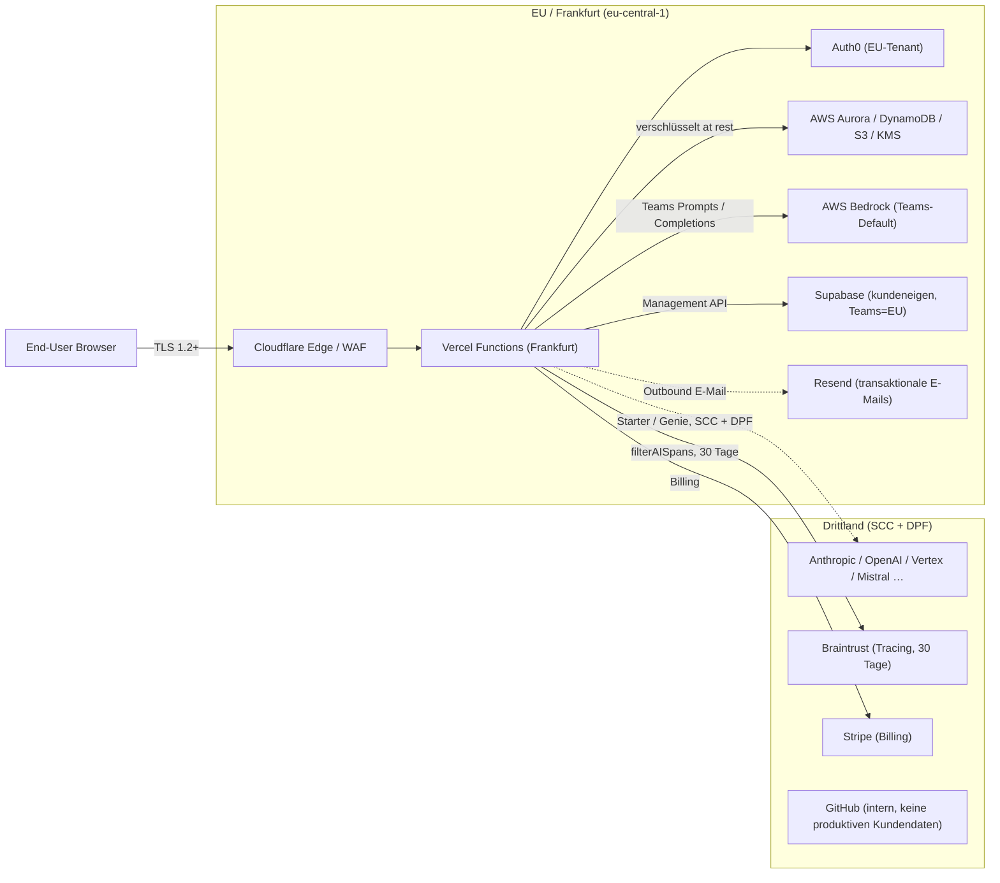

Adressaten: Kunden, deren Einkauf und deren Datenschutzbeauftragte (DSB).

Dieses Paket übergeben wir, wenn ein Kunde den AVV, die dokumentierten technischen und organisatorischen Maßnahmen (TOM), die Liste der Unterauftragsverarbeiter, das Datenschutz- bzw. Löschkonzept und unsere Prozesse zur Erfüllung von Betroffenenrechten anfordert.

Wir führen ein internes Evidenzpaket, das an ISO-27001-Controls (Annex A) ausgerichtet ist; eine ISO-Zertifizierung besteht zum heutigen Stand nicht. Das Paket ist auf Anfrage verfügbar. Beide Dokumente werden synchron gehalten.

<Note>
  **Hinweis:** Felder zur juristischen Firmierung in §0 sind aktuell mit `[TBD]` markiert und werden vor Versand an einen konkreten Kunden ausgefüllt. Bitte vor Weitergabe prüfen.
</Note>

**Gliederung:**

0. Über uns — Firmierung und Verantwortliche
1. Rollenmodell — Verantwortlicher und Auftragsverarbeiter
2. Auftragsverarbeitungsvertrag (AVV) — Mustervereinbarung
3. High-Level-Architektur und Datenflüsse
4. Unterauftragsverarbeiter — wen wir einsetzen und wofür
5. Verarbeitete Daten, betroffene Personen, Zwecke
6. Technische Maßnahmen (TOM nach Art. 32 DSGVO)
7. Organisatorische Maßnahmen
8. Datenschutz- und Löschkonzept
9. Erfüllung von Betroffenenrechten
10. Wie wir die tatsächliche Löschung sicherstellen
11. Kontakte und Änderungsmitteilungen

---

## 0. Über uns — Firmierung und Verantwortliche

- **Vollständige juristische Firmierung:** `[TBD]`
- **Anschrift:** `[TBD]`
- **Vertretungsberechtigte:** `[TBD]`
- **Handelsregister:** `[TBD — HRB / Amtsgericht]`
- **USt-IdNr.:** `[TBD]`
- **Datenschutzbeauftragter:** `[TBD — Name, E-Mail; oder: nicht bestellungspflichtig nach §38 BDSG]`
- **EU-Representative (Art. 27 DSGVO):** nicht erforderlich — Sitz in der EU
- **Hauptansprechpartner Security / Privacy:** `privacy@genie-app.de` / `security@genie-app.de`

---

## 1. Rollenmodell — Verantwortlicher und Auftragsverarbeiter

Genie verarbeitet personenbezogene Daten in zwei klar getrennten Rollen:

- **Auftragsverarbeiter im Sinne von Art. 28 DSGVO** — für Daten, die unmittelbar im Rahmen der Genie-Dienste anfallen (Identitäts- und Profildaten, Abrechnungsdaten, Chat- und Projektinhalte, Betriebs­telemetrie). Verantwortlicher im Sinne von Art. 4 Nr. 7 DSGVO ist der Kunde. Rechtsgrundlage und Pflichten siehe §2 (AVV).
- **Nicht-Verantwortlicher für Kunden-Supabase-Projekte** — für Daten, die Kunden in ihren eigenen Supabase-Projekten verarbeiten, agiert Genie grundsätzlich **nicht** als Verantwortlicher. Der Kunde bleibt Verantwortlicher im Sinne von Art. 4 Nr. 7 DSGVO. Genie hält ausschließlich Management-API-Credentials und hat keine operative Sichtbarkeit auf den Inhalt dieser Datenbanken.

---

## 2. Auftragsverarbeitungsvertrag (AVV) — Mustervereinbarung

Unseren Standard-AVV stellen wir auf Anfrage an `privacy@genie-app.de` als gegengezeichnete PDF bereit. Die folgende Vorlage entspricht inhaltlich dieser PDF und kann durch den DSB des Kunden vorab geprüft werden.

<Warning>
  **Vorlage — kein unterzeichneter Vertrag.** Ein verbindlicher AVV kommt erst durch Gegenzeichnung zustande. Anfragen bitte an `privacy@genie-app.de` mit Angabe der juristischen Person, Ansprechperson und der vorgesehenen Datenkategorien; wir liefern die gegengezeichnete PDF innerhalb von 5 Werktagen zurück.
</Warning>

### 2.1 Vertragsparteien

- **Verantwortlicher**: der im Genie-Bestellformular benannte Kunde.
- **Auftragsverarbeiter**: die im Genie-Bestellformular benannte Genie-Gesellschaft (siehe §0).

### 2.2 Gegenstand und Dauer der Verarbeitung

Verarbeitung personenbezogener Daten zum Zweck der Erbringung des Genie-Dienstes gemäß Bestellformular. Der AVV läuft für die Laufzeit des zugrunde liegenden Hauptvertrags und endet mit der Löschung der Kundendaten gemäß §8.

### 2.3 Art und Zweck der Verarbeitung

Betrieb einer gehosteten Anwendungsentwicklungsplattform: Identität, Abrechnung, Projekthosting, LLM-gestützte Codegenerierung, Deployment in ein kundeneigenes Supabase-Projekt, Observability und Kundensupport.

### 2.4 Art der personenbezogenen Daten und Kategorien betroffener Personen

Siehe §5 dieses Dokuments; dieser Abschnitt ist durch Verweis Bestandteil des AVV.

### 2.5 Pflichten des Auftragsverarbeiters

Der Auftragsverarbeiter:

- verarbeitet personenbezogene Daten nur auf dokumentierte Weisung des Verantwortlichen (Bestellformular, dieser AVV und Tickets über `privacy@genie-app.de` gelten als dokumentierte Weisungen);
- verpflichtet alle zur Verarbeitung befugten Personen zur Vertraulichkeit;
- setzt die TOM nach §6 um und hält sie aktuell;
- setzt Unterauftragsverarbeiter nur gemäß §4 ein und kündigt das Hinzunehmen oder Ersetzen mindestens **30 Tage vorher** an (Widerspruchsrecht nach Art. 28 Abs. 2 DSGVO);
- unterstützt den Verantwortlichen bei der Erfüllung von Betroffenenrechten nach §9;
- unterstützt bei Sicherheitsvorfällen, DSFA und vorheriger Konsultation gemäß Art. 28 Abs. 3 lit. f DSGVO;
- löscht oder gibt nach Wahl des Verantwortlichen alle personenbezogenen Daten bei Vertragsende zurück (§8 / §10);
- stellt alle zum Nachweis der Einhaltung erforderlichen Informationen bereit und ermöglicht Audits nach §2.7.

### 2.6 Unterauftragsverarbeiter

Aufgeführt in §4. Die zum Zeitpunkt der Unterzeichnung gültige Liste ist die vereinbarte Ausgangslage; nachfolgende Änderungen erfolgen nach dem 30-Tage-Verfahren oben.

### 2.7 Auditrechte

Der Verantwortliche kann die Einhaltung des AVV prüfen:

- durch Einsicht in dieses Dokument und das verlinkte, an ISO-27001-Controls ausgerichtete Evidenzpaket;
- durch Anforderung der aktuellen **SOC-2-Type-II-** oder gleichwertigen Auditberichte unserer Unterauftragsverarbeiter;
- einmal pro Kalenderjahr durch ein Vor-Ort- oder Remote-Audit mit mindestens 30 Tagen Vorlauf, auf Kosten des Verantwortlichen, zu üblichen Geschäftszeiten und vorbehaltlich einer beiderseits akzeptierten Geheimhaltungsvereinbarung.

### 2.8 Internationale Datenübermittlungen

Die primäre Verarbeitung erfolgt in **AWS eu-central-1 (Frankfurt)**. Übermittlungen an Unterauftragsverarbeiter außerhalb EU/EWR (z. B. LLM-Anbieter in den USA) erfolgen auf Grundlage der EU-Standardvertragsklauseln (2021/914) und, soweit anwendbar, des EU–US Data Privacy Framework.

**Teams-Konten / Workspaces — EU-Datenhaltung:** Für Kunden mit einem Teams-Plan werden alle personenbezogenen Nutzerdaten **ausschließlich innerhalb der EU** verarbeitet und gespeichert. Sofern ein Dienst eine deutsche Region anbietet (z. B. AWS eu-central-1, Frankfurt), wird diese bevorzugt genutzt. LLM-Inferenz für Teams-Nutzer wird über **AWS Bedrock (eu-central-1)** geroutet, sodass Prompts und Completions die EU nicht verlassen.

### 2.9 Haftung und Laufzeit

Gemäß zugrunde liegendem Bestellformular. Kündigung, anwendbares Recht und Gerichtsstand folgen ebenfalls dem Bestellformular.

---

## 3. High-Level-Architektur und Datenflüsse

Die folgende Übersicht beschreibt, welche Komponenten im Betrieb der Genie-Plattform zusammenwirken und welche Daten zwischen ihnen fließen. Detaillierte Regions- und Compliance-Angaben pro Unterauftragsverarbeiter siehe §4.

| Komponente | Region | Verschlüsselung in Transit | Verschlüsselung at Rest | Drittland-Mechanismus |
| --- | --- | --- | --- | --- |
| Cloudflare (Edge / WAF) | Globales Edge-Netz, primär EU-PoPs | TLS 1.2+ | n/a | n/a (Edge-Termination in der EU) |
| Vercel Functions | EU (Frankfurt, DE) | TLS 1.2+ | Plattform-managed | n/a |
| Auth0 | EU-Tenant | TLS 1.2+ | Plattformseitig | n/a |
| AWS Aurora / DynamoDB / S3 / KMS | eu-central-1 (Frankfurt) | TLS 1.2+ | AWS KMS / SSE | n/a |
| AWS Bedrock | eu-central-1 (Frankfurt) | TLS 1.2+ | AWS-Posture | n/a |
| Supabase (kundeneigen) | EU (Frankfurt) für Teams; sonst vom Kunden gewählt | TLS 1.2+ | Plattformseitig | n/a, sofern EU |
| Resend | EU | TLS 1.2+ | Plattformseitig | n/a |
| Braintrust | EU-Region | TLS 1.2+ | Plattformseitig | SCC, soweit anwendbar |
| LLM-Anbieter (Anthropic / OpenAI / Vertex / Mistral / xAI / Perplexity / Replicate / Voyage) | Je Anbieter; US bei Anthropic / OpenAI | TLS 1.2+ | Plattformseitig | SCC (2021/914), EU–US Data Privacy Framework wo verfügbar |
| Stripe | EU mit US-Submetadaten | TLS 1.2+ | PCI-Scope bei Stripe | SCC für US-Submetadaten |
| GitHub | US | TLS 1.2+ | Plattformseitig | SCC; keine produktiven Kundendaten |

Die primäre Datenhaltung erfolgt in **AWS eu-central-1 (Frankfurt)**. Für Teams-Konten wird die LLM-Inferenz über AWS Bedrock (eu-central-1) geroutet; Prompts und Completions verlassen die EU nicht.

---

## 4. Unterauftragsverarbeiter — wen wir einsetzen und wofür

Für jeden gelisteten Unterauftragsverarbeiter liegt ein unterzeichneter AVV bzw. liegen Standardvertragsklauseln vor. Die Tabelle hier ist die kundenseitige Sicht.

### 4a. Interne Infrastruktur (keine produktiven Kundendaten)

Diese Dienste werden ausschließlich intern von Genie genutzt. Es werden grundsätzlich keine produktiven Kundendaten verarbeitet.

| # | Unterauftragsverarbeiter | Was er für uns tut | Datenkategorien | Region | Compliance |
| --- | --- | --- | --- | --- | --- |
| 1 | **GitHub** | Source-Hosting und CI für Genie selbst. Es werden grundsätzlich keine produktiven Kundendaten verarbeitet; interne CI-Logs können personenbezogene Bezüge enthalten (z. B. Commit-Autoren). | Quellcode, CI-Logs | US (SCC) | SOC 1/2, ISO 27001 |
| 2 | **Unsplash** | Bildersuche im In-App-Asset-Picker. Read-only; es werden grundsätzlich keine produktiven Kundendaten gespeichert. Suchstrings können personenbezogen sein und werden ausschließlich für die Suchanfrage an Unsplash übergeben. | Suchstring | US (Read-only Public API) | n/a |

### 4b. Nutzerinfrastruktur (verarbeitet Nutzerdaten)

Diese Dienste sind direkt in den Betrieb der Genie-Plattform und der Nutzer-Apps eingebunden. Sie verarbeiten personenbezogene Daten von Endnutzern.

| # | Unterauftragsverarbeiter | Was er für uns tut | Datenkategorien | Region | Compliance |
| --- | --- | --- | --- | --- | --- |
| 1 | **Auth0 (Okta)** | Föderierte Identität, OIDC-Anmeldung (Passwort / Social / SSO). Wir sehen und speichern das Passwort nie. | E-Mail, Name, Auth0-Benutzer-ID, IP bei Anmeldung, MFA-Faktoren | EU | SOC 2 Type II, ISO 27001 |
| 2 | **Stripe** | Abonnementabrechnung, Zahlungsmittel, Rechnungen, Steuer. Der PCI-Scope liegt vollständig bei Stripe; wir sehen die PAN nie. | Name, E-Mail, Rechnungsanschrift, Zahlungsmittel-Token, Rechnungspositionen | EU | PCI DSS L1, SOC 1/2 |
| 3 | **Braintrust** | LLM-Observability — Traces, Evals, Prompt-Versionen. 30 Tage Retention. Es werden ausschließlich AI-bezogene Spans exportiert (`filterAISpans`). | Prompts, Completions, Traces | EU | SOC 2 Type II |
| 4 | **AWS** (Aurora Postgres, S3, DynamoDB, Lambda, CloudFront, KMS, Secrets Manager, CodeBuild) | Primäre Anwendungsinfrastruktur: relationale DB, Objektspeicher, Key-Value-Store, CDN, Secret-Storage, Build-Runner. | Alle Anwendungsdaten; verschlüsselte Kundensecrets | eu-central-1 (Frankfurt) | ISO 27001, SOC 1/2/3, C5, FedRAMP |
| 5 | **Supabase** | Pro-Kunde-Postgres \+ Edge Functions für die eigene App des Kunden. Wir halten ausschließlich Management-API-Credentials. **Teams-Workspaces werden standardmäßig in der EU (Frankfurt) provisioniert.** | Alles, was der Kunde in seine App einspeist | EU (Frankfurt) für Teams; sonst vom Kunden wählbar | SOC 2 Type II |
| 6 | **Cloudflare** | CDN, WAF, DNS, Custom-Hostname-Routing, Worker für Tenant-Routing. | TLS-Traffic, Request-Metadaten, IP, Custom-Hostnames | Globales Edge-Netz, primär EU-PoPs | ISO 27001, SOC 2 |
| 7 | **Vercel** | Hosting der Genie-Webanwendung, OpenTelemetry-Bridge. Request-Routing erfolgt automatisch zum nächstgelegenen Server; Serverless Functions laufen in Frankfurt (DE). | Request-Metadaten, Telemetrie, Build-Logs | EU (Frankfurt, DE) | SOC 2 Type II |
| 8 | **Anthropic** | LLM-Inferenz für Genie-Agentenfunktionen und LLM-Proxy (Starter / Genie-Pläne). Zero-Retention-Vereinbarung vorhanden. **Teams-Nutzer werden über AWS Bedrock (eu-central-1) geroutet — keine direkte Datenübermittlung an Anthropic.** | Prompts und Completions | US (SCC) — nur Starter / Genie-Pläne | SOC 2 Type II |
| 9 | **AWS Bedrock** | LLM-Inferenz geroutet über unseren AWS-Account. **Standard-LLM-Anbieter für alle Teams-Nutzer** — stellt sicher, dass keine Prompts oder Completions die EU verlassen. | Prompts und Completions | eu-central-1 (Frankfurt) | Erbt AWS-Posture |
| 10 | **OpenAI** | LLM-Inferenz für Nicht-Teams-Konten. Zero-Data-Retention-Vereinbarung vorhanden. | Prompts und Completions | US (SCC) — nur Starter / Genie-Pläne | SOC 2 Type II |
| 11 | **Google Vertex AI** | Optionaler LLM-Anbieter (Gemini) und Embeddings. | Prompts und Completions | EU-Region verfügbar | ISO 27001, SOC 1/2/3 |
| 12 | **Mistral / xAI / Replicate / Voyage / Perplexity** | Optionale LLM- und Embedding-Anbieter, pro Projekt wählbar. | Prompts, Completions, Embeddings | Je Anbieter; SCC bei Drittländern | SOC 2 (jeweils) |
| 13 | **Resend** | Transaktionale E-Mails (Proxy für Kunden-Edge-Functions). | Empfängeradresse, Betreff und Inhalt | EU | SOC 2 Type II |
| 14 | **Hugging Face** | Inferenz-Proxy-Ziel für Kunden-ML-Features. Wird ausschließlich aktiviert, wenn der Nutzer dies explizit konfiguriert. | Prompts / Eingaben aus Kunden-Edge-Functions | US (SCC); EU-Endpoint wo verfügbar | SOC 2 Type II |

---

## 5. Verarbeitete Daten, betroffene Personen, Zwecke

Bestandteil des AVV (§2.4).

### 5.1 Kategorien betroffener Personen

- **Endnutzer** des Kundenaccounts (natürliche Personen, die sich bei Genie anmelden).
- **Empfänger von E-Mails**, die der Kunde über seine Edge Functions per Resend-Proxy versendet.
- **Besucher** kundengehosteter Anwendungen (nur insoweit der Kunde deren Daten in seinem eigenen Supabase-Projekt erfasst — diese Daten sind für Genie nicht sichtbar, siehe §1).

### 5.2 Kategorien personenbezogener Daten

| Kategorie | Beispiele | Speicherort |
| --- | --- | --- |
| Identität & Profil | E-Mail, Anzeigename, Avatar-URL | AWS; Auth0 |
| Authentifizierungs-Metadaten | Anmelde-IP, MFA-Faktoren, letzter Login | Auth0 |
| Abrechnung | Name, Rechnungsadresse, Zahlungsmittel-Token, Rechnungen, Steuer-ID | Stripe; AWS |
| Vom Nutzer erstellte Inhalte | Chatnachrichten, Prompts, Datei-Uploads, generierter Quellcode, Projektmetadaten | AWS |
| Betriebstelemetrie | Fehlermeldungen, Timings, LLM-Traces, Request-Logs | AWS; Braintrust (30 Tage) |
| Push & Benachrichtigungen | Web-Push-Endpoints, Subscription-Metadaten | AWS |
| Audit-Trail | Workspace-Activity-Log: wer hat wann was getan | AWS (append-only) |
| Vom Kunden eingebrachte Secrets | MCP-Credentials, API-Keys | AWS (verschlüsselt) |
| Empfängerdaten ausgehender E-Mails | Empfängeradresse, Betreff, Inhalt | Resend (transaktional) |
| LLM-Payloads | Prompts und Completions aus Genie-Funktionen und Kunden-Edge-Functions | Der für das Projekt gewählte LLM-Anbieter (siehe §4) |

Genie selbst verarbeitet keine besonderen Kategorien personenbezogener Daten (Art. 9 DSGVO). Falls der Kunde solche Daten in sein eigenes Supabase-Projekt einspeist, liegt diese Verarbeitung in seiner Verantwortung (siehe §1).

### 5.3 Zwecke

- Erbringung des Genie-Dienstes gemäß Bestellformular.
- Identität, Authentifizierung und Zugangskontrolle.
- Abrechnung und steuerliche Pflichten.
- LLM-gestützte Codegenerierung und Chat.
- Deployment und Betrieb kundeneigener Anwendungen auf Supabase.
- Sicherheitsmonitoring, Missbrauchsprävention, Incident Response.
- Gesetzliche Aufbewahrung (Rechnungen, Audit-Trail).

### 5.4 Umgang mit LLM-Daten

- **Modelltraining.** Es werden grundsätzlich keine produktiven Kundendaten für das Training von Modellen verwendet — weder durch uns noch durch unsere LLM-Anbieter. Mit Anthropic, OpenAI und AWS Bedrock bestehen vertragliche Zusagen zu Zero-Data-Retention bzw. No-Training-on-Inputs (Nachweis auf Anfrage). Für Teams-Pläne läuft die Inferenz über AWS Bedrock (`eu-central-1`); ein direkter Datenfluss an Anthropic oder OpenAI findet hier nicht statt.
- **Prompt-Leakage-Prävention.** Der Prompt-Kontext wird strikt auf den jeweiligen Nutzer und sein Projekt eingegrenzt; eine projekt­übergreifende Verarbeitung in einer gemeinsamen LLM-Session findet nicht statt. Datenbankzugriffe sind durch Row-Level Security und nutzerskopierte Anwendungs­kontexte abgesichert (siehe §6.1).
- **Embeddings.** In der Genie-Infrastruktur werden derzeit keine Embeddings persistiert. Sofern Kunden über Edge Functions in ihrem eigenen Supabase-Projekt Embeddings erzeugen oder ablegen, liegt deren Speicherung in der Verantwortung des Kunden (siehe §1).
- **LLM-Traces (Braintrust).** Es werden ausschließlich AI-bezogene Spans exportiert (`filterAISpans`), Retention 30 Tage. **Ein Opt-out auf Kundenebene besteht zum heutigen Stand nicht.** Zugriff auf Traces ist auf benannte Personen mit Produktiv­berechtigung beschränkt, MFA-geschützt und wird protokolliert (siehe §7.6).
- **Provider-Deaktivierung.** Optionale LLM-Anbieter (Mistral, xAI, Replicate, Voyage, Perplexity, Hugging Face) werden nur dann aktiviert, wenn der Kunde sie in seinen Projekt­einstellungen explizit konfiguriert.

---

## 6. Technische Maßnahmen (TOM, Art. 32 DSGVO)

Dokumentiert nach Art. 32 DSGVO. Wir haben technische und organisatorische Maßnahmen implementiert, um die Vertraulichkeit, Integrität, Verfügbarkeit und Belastbarkeit der Verarbeitungs­systeme und -dienste sicherzustellen.

### 6.1 Vertraulichkeit (Art. 32 Abs. 1 lit. b)

| Maßnahme | Umsetzung |
| --- | --- |
| **Zutritts- / Zugangskontrolle — Identität** | Föderierte Identität über Auth0 (OIDC). Authentifizierungs­tokens sind kryptographisch signiert; die Signatur wird serverseitig vor jeder Sitzungsentscheidung verifiziert. Es werden keine Passwörter in der Anwendung gespeichert. |
| **Zugriffskontrolle — Autorisierung** | Row-Level Security auf Datenbankebene. Jede Anfrage läuft in einem nutzerskopierten Kontext; Policies entscheiden über Datensichtbarkeit. |
| **Least Privilege — Entwickler** | Produktivzugriffe werden rollenbasiert vergeben und mindestens quartalsweise überprüft. Änderungen an sicherheits­relevanten Codepfaden erfordern eine dokumentierte Freigabe durch eine zweite Person. |
| **Least Privilege — Infrastruktur** | AWS-IAM-Rollen pro Dienst zugeschnitten; Secrets ausschließlich im Secrets Manager. |
| **Verschlüsselung der Übertragung** | TLS 1.2\+ terminiert an der Cloudflare- / AWS-Edge. HSTS aktiv. |
| **Verschlüsselung at Rest — Infrastruktur** | Alle Datenbanken und Speicher-Dienste sind at-rest-verschlüsselt (AWS KMS). |
| **Verschlüsselung at Rest — Secrets** | Kundensecrets werden vor dem Speichern Ende-zu-Ende-verschlüsselt. Versionierte Schlüssel für unterbrechungsfreie Rotation; jährliche Rotation. |
| **Secret-Hygiene in CI** | Automatisierter Secret-Scan bei jedem Code-Push. GitHub Secret Scanning \+ Push Protection aktiviert. |
| **Log-Verbot für sensible Felder** | Klartext-Secrets, MCP-Credentials, vollständige Billing-Request-Bodies und PII dürfen nicht geloggt werden. |

### 6.2 Integrität (Art. 32 Abs. 1 lit. b)

| Maßnahme | Umsetzung |
| --- | --- |
| **Append-only-Audit-Log** | Der Workspace-Activity-Log ist technisch gegen nachträgliche Änderung oder Löschung geschützt; Anonymisierung nur durch den kontrollierten Account-Löschjob. |
| **Signierte Tokens** | Authentifizierungs­tokens sind kryptographisch signiert; Manipulation wird zurückgewiesen. |
| **Signierte Webhooks** | Stripe- und Auth0-Webhook-Signaturen werden vor jeder Statusänderung verifiziert. |
| **Change Management** | Änderungen an produktionsrelevanten Systemen erfordern einen dokumentierten Review- und Freigabeprozess durch eine zweite Person. Verpflichtende automatisierte Checks (Tests, Secret-Scan, Dependency-Scan) müssen vor dem Merge erfolgreich sein. |

### 6.3 Verfügbarkeit und Belastbarkeit (Art. 32 Abs. 1 lit. b)

| Maßnahme | Umsetzung |
| --- | --- |
| **Backups** | Aurora Point-in-Time-Recovery, 35 Tage Retention. S3-Versionierung auf den Buckets mit Kundeninhalten. |
| **Multi-AZ** | Aurora und DynamoDB sind in eu-central-1 standardmäßig Multi-AZ. |
| **DDoS / WAF** | Cloudflare WAF vor allen kundenseitigen Endpunkten. |
| **Workflow-Durabilität** | Lang laufende Jobs laufen auf einer durablen Workflow-Runtime, die Host-Restarts und Deploys übersteht. |

### 6.4 Wiederherstellbarkeit (Art. 32 Abs. 1 lit. c)

- Aurora-PITR (35 Tage) wird mindestens quartalsweise in Staging geübt.
- Disaster-Recovery-Runbook liegt im privaten Ops-Repo; RPO ≤ 5 min, RTO ≤ 4 h für die Genie-Control-Plane. Kundenseitige Supabase-Projekte erben Supabases eigene DR-Posture.
- Über die rein technische Wiederherstellung hinaus ist der Kommunikations- und Eskalationsprozess im Business Continuity Plan (§6.9) beschrieben.

### 6.5 Pseudonymisierung (Art. 32 Abs. 1 lit. a)

- Der Audit-Trail wird bei Account-Löschung in place anonymisiert — der gesetzliche Nachweis bleibt erhalten, ohne PII zu speichern.
- Der Nachweis der Löschung wird pseudonymisiert geführt, ohne den Identifier selbst aufzubewahren.

### 6.6 Regelmäßige Überprüfung (Art. 32 Abs. 1 lit. d)

| Maßnahme | Frequenz |
| --- | --- |
| Automatisierte Tests bei jeder Codeänderung | pro Commit |
| Abhängigkeits-Vuln-Scan | pro Commit |
| Secret-Scan | pro Commit |
| Penetrationstest | jährlich (extern) |
| SEV-1-Tabletop-Übung | jährlich |
| Access-Review | quartalsweise |
| Unterauftragsverarbeiter- / AVV-Review | jährlich |
| Schlüsselrotation | jährlich oder bei Verdacht auf Kompromittierung |
| Backup-Restore-Übung | quartalsweise |

### 6.7 Vulnerability- und Patch-Management

- Kontinuierliches Dependency-Scanning bei jedem Commit (siehe §6.6); Befunde werden zentral nachverfolgt.
- Kritikalitäts­klassifizierung erkannter Schwachstellen nach CVSS v3.1 mit folgenden Ziel-Behebungs­fristen:

| Kritikalität | CVSS-Bereich | Ziel-Behebungsfrist |
| --- | --- | --- |
| Critical | ≥ 9.0 | ≤ 7 Tage, priorisiertes Patching |
| High | 7.0 – 8.9 | ≤ 30 Tage |
| Medium | 4.0 – 6.9 | ≤ 90 Tage |
| Low | < 4.0 | bündelweise im regulären Releasezyklus |

- Out-of-Band-Releases für Critical-Findings sind möglich; sie folgen einem verkürzten, jedoch ebenfalls dokumentierten Review-Pfad (siehe §6.2).
- Externer Penetrationstest jährlich (Bestand, vgl. §6.6); identifizierte Findings werden nach derselben Kritikalitäts­matrix bearbeitet.

### 6.8 Vorfall-Reaktion (Art. 33 / 34 DSGVO)

- 24/7-On-Call-Rotation; Triage-SLA 30 Minuten.
- Betroffene Kunden werden unverzüglich informiert, sobald hinreichend gesicherte Erkenntnisse über einen meldepflichtigen Vorfall vorliegen. Die 72-Stunden-Frist gegenüber der zuständigen Aufsichts­behörde wird vom Verantwortlichen eingehalten; wir stellen die nach Art. 33 Abs. 3 DSGVO erforderlichen Informationen unverzüglich bereit.
- Vollständiger Lebenszyklus, Beweissicherung und Post-Mortem-Kadenz sind intern dokumentiert und werden bei Audits auf Anfrage bereitgestellt.

### 6.9 Business Continuity Plan

Abgrenzung: §6.3 beschreibt technische Redundanz, §6.4 die technische Wiederherstellbarkeit. Der Business Continuity Plan ergänzt dies um die organisatorische Ausfall- und Kommunikationsorganisation.

- **Ausfallorganisation.** 24/7-On-Call-Rotation mit definiertem Eskalationspfad (On-Call → Incident Commander → Executive Sponsor).
- **Kommunikationsprozesse.** Status-Updates an betroffene Kunden über `status.genie-app.de` und per E-Mail an den hinterlegten Hauptkontakt. Sicherheits­relevante Meldungen zusätzlich über `security@genie-app.de` (siehe §11).
- **Verantwortlichkeiten.** Der Incident Commander koordiniert die technische Wiederherstellung; der Privacy Lead bewertet Meldepflichten gemäß Art. 33 / 34 DSGVO; der Executive Sponsor entscheidet über externe Kommunikation.
- **Übung.** Die jährliche SEV-1-Tabletop-Übung (siehe §6.6) deckt sowohl die DR- als auch die BCP-Kommunikations­prozesse ab.

### 6.10 Auftragskontrolle / Unterauftragsverarbeiter (Art. 28 DSGVO)

Siehe §2.6 / §4: SOC-2-Report oder gleichwertig eingeholt, AVV unterzeichnet, Register jährlich überprüft, 30 Tage Vorlauf vor Aufnahme oder Wechsel eines Unterauftragsverarbeiters.

---

## 7. Organisatorische Maßnahmen

Ergänzend zu den technischen Maßnahmen in §6 sind die folgenden organisatorischen Maßnahmen implementiert.

### 7.1 Security Awareness und Trainings

Mitarbeitende mit Zugriff auf produktive Systeme oder Kundendaten durchlaufen ein Security- und Datenschutz-Training beim Onboarding sowie regelmäßige Auffrischungen. Spezialisierte Trainings (z. B. sicheres Coding) ergänzen die Basis.

### 7.2 Vertraulichkeit, NDAs und Joiner-Mover-Leaver

Alle Mitarbeitenden sind vertraglich zur Vertraulichkeit verpflichtet. Onboarding, Rollenwechsel und Offboarding folgen einem dokumentierten Prozess, der das Vergeben, Anpassen und Entziehen von Zugriffsrechten regelt. Berechtigungen werden bei Ausscheiden unverzüglich entzogen.

### 7.3 Asset- und Endpoint-Management

Unternehmensgeräte werden zentral inventarisiert und verwaltet. Verschlüsselung der Festplatte, Bildschirmsperre, automatische Updates und Endpoint-Schutz sind verpflichtend.

### 7.4 Lieferanten- und Drittparteienmanagement

Unterauftragsverarbeiter werden vor Einsatz auf datenschutz- und sicherheits­relevante Anforderungen geprüft (SOC-2- bzw. ISO-27001-Berichte, AVV, ggf. SCC). Bestand siehe §4. Jährliches Re-Assessment (siehe §6.6).

### 7.5 Zugangs- und Passwort-Policy, MFA

Identitätsbasierte Anmeldungen erfolgen über einen zentralen Identity Provider mit erzwungener Multi-Faktor-Authentifizierung für alle Mitarbeitenden­konten und insbesondere für jeden Produktiv­zugriff. Passwort­anforderungen entsprechen anerkannten Standards (NIST SP 800-63B).

### 7.6 Mitarbeiterzugriffe auf Kundendaten

Zugriffe auf produktive Kundendaten erfolgen ausschließlich nach dem Need-to-know-Prinzip, sind rollenbasiert vergeben, MFA-geschützt und werden protokolliert. Break-Glass-Zugriffe sind technisch möglich, werden vor oder unverzüglich nach dem Zugriff dokumentiert, vom Privacy Lead nachgehalten und im quartalsweisen Access-Review (siehe §6.6) überprüft. Es existiert keine generelle Lese­berechtigung auf Kundendaten ohne dokumentierten Anlass.

---

## 8. Datenschutz- und Löschkonzept

Wir löschen auf drei Granularitäten. Alle drei halten das DSGVO-Fenster von 30 Tagen ein und sind end-to-end auditierbar.

### 8.1 Inventar — wo liegen personenbezogene Daten

- **AWS** — Primäre Datenhaltung: Nutzerprofile, Projekte, Chatnachrichten, Uploads, Secrets, Audit-Logs, Deployment-Metadaten, transiente Workflow-Zustände.
- **Auth0** — Authentifizierungsdaten (E-Mail, MFA-Faktoren, Anmelde-IP).
- **Stripe** — Abrechnungsdaten (Name, Adresse, Zahlungsmittel-Token, Rechnungen).
- **Supabase** — Kundeneigene App-Datenbank (Inhalt liegt in der Verantwortung des Kunden, siehe §1).
- **Braintrust** — LLM-Traces und Observability-Daten (30 Tage Retention).
- **Resend** — Transaktionale E-Mails (Empfängeradresse, Inhalt).

### 8.2 Aufbewahrungsfristen

| Kategorie | Aufbewahrung | Rechtsgrundlage |
| --- | --- | --- |
| Account-Profil | Lebensdauer des Accounts, dann Löschung nach §8.3 | Erforderlich zum Betrieb |
| Workspace-Activity-Log | Unbefristet, **anonymisiert** bei Account-Löschung | Art. 6 Abs. 1 lit. f — Audit & Missbrauchsprävention |
| Fehler-Datensätze | 90 Tage | Betriebliches Debugging |
| Abrechnungsdaten (gespiegelt von Stripe) | 7 Jahre | Steuerliche / gesetzliche Aufbewahrung (HGB / AO) |
| Anwendungs-Logs / LLM-Traces (Braintrust) | 30 Tage | Observability |
| Datenbank-Backups (AWS PITR) | 35 Tage | Disaster Recovery |
| Vom Kunden eingebrachte Secrets | Bis zur Löschung des zugehörigen Projekts | Kundeneigentum |
| MCP-OAuth-Handshake-Zustand | ca. 10 min TTL | Transient |
| Pending File Edits (DynamoDB-TTL) | 1 Stunde | Transient |
| LLM-Proxy-Usage-Datensätze | 90 Tage | Abrechnungsabgleich; anschließend aggregiert |

### 8.3 Account-Löschung (Art. 17 DSGVO)

Wird vom Kunden in `/account/settings` ausgelöst und durch Tippen der E-Mail bestätigt. Die Orchestrierung läuft als durabler Workflow (`deleteAccountWorkflow`) und übersteht Abstürze und Deploys.

1. **Pre-Flight (synchron).** Session prüfen, doppelte Anfragen deduplizieren, Löschjob mit 14-Tage-Vorlauf anlegen.
2. **Deaktivierung (sofort, reversibel).** Anmeldung blockieren, laufende Subscriptions auf Ablauf zum Periodenende setzen, kundenseitige Datenbank pausieren.
3. **14-Tage-Karenzfrist.** Der Kunde kann in den Settings abbrechen.
4. **Irreversible Kaskade** (in dieser Reihenfolge):
   - Alle laufenden Hintergrundprozesse für diesen Nutzer abbrechen.
   - Alle Projekte des Nutzers vollständig löschen.
   - Gespeicherte Dateien und Uploads entfernen; CDN-Cache invalidieren.
   - Alle Datenbankeinträge in Abhängigkeitsreihenfolge löschen; Audit-Log-Einträge anonymisieren.
   - Externe Konten bei Stripe, Supabase und Auth0 kündigen.
5. **Audit.** Pseudonymisierter Löschnachweis wird gespeichert (kein personenbezogener Identifier).

### 8.4 Projekt-Löschung

Gleiche Workflow-Form, 7-Tage-Karenzfrist, auf ein einzelnes Projekt beschränkt.

### 8.5 Gezielte Datensatz-Löschung

Der Kunde kann die Löschung bestimmter Datensätze verlangen (eine einzelne hochgeladene Datei, ein einzelner Chat-Thread, eine Push-Subscription) ohne Account-weite Löschung. Anfragen über `privacy@genie-app.de` oder Support-Ticket.

### 8.6 Propagation an Unterauftragsverarbeiter

Jede externe Kündigung hat einen dokumentierten Endpunkt und idempotentes Retry-with-Backoff. Fehler werden in Admin-Tools sichtbar. Etwaige externe Reste werden durch §10 erfasst.

---

## 9. Erfüllung von Betroffenenrechten

| Recht (DSGVO) | Mechanismus | SLA |
| --- | --- | --- |
| **Art. 15 — Auskunft** | Self-Service in der App für Profil, Projekte, Abrechnungshistorie. Vollständiger strukturierter Export über `privacy@genie-app.de`. | 30 Tage |
| **Art. 16 — Berichtigung** | Profilfelder in der App editierbar. Abrechnungsdaten über das Stripe-Customer-Portal. Sonstige Felder über `privacy@genie-app.de`. | Profil / Abrechnung sofort; ticketbasierte Felder 30 Tage |
| **Art. 17 — Löschung** | Self-Service in `/account/settings` (§8.3). Auch per `privacy@genie-app.de` möglich. | Innerhalb von 14 Tagen ausgelöst |
| **Art. 18 — Einschränkung** | Account-weite Deaktivierung blockiert Anmeldung und pausiert Verarbeitung ohne Löschung. | Innerhalb von 14 Tagen |
| **Art. 20 — Datenübertragbarkeit** | Gleiches Paket wie Art. 15, in maschinenlesbarem JSON. | 30 Tage |
| **Art. 21 — Widerspruch** | `privacy@genie-app.de`. | 30 Tage |
| **Art. 22 — Automatisierte Entscheidungen** | Wir treffen keine rechtsverbindlichen Entscheidungen auf automatisierter Basis. LLM-Ausgaben sind Vorschläge und werden erst durch eine menschliche Handlung wirksam. | n/a |
| **Art. 7 Abs. 3 — Widerruf der Einwilligung** | Einwilligungselemente sind in den Account-Settings schaltbar; Widerruf wird beim Speichern wirksam. | Sofort |
| **Beschwerde bei einer Aufsichtsbehörde** | Betroffene können ihre lokale Datenschutzaufsicht anrufen. Federführende Behörde für EU-Kunden: **Hessischer Beauftragter für Datenschutz und Informationsfreiheit** (Frankfurt). | n/a |

### 9.1 Identitätsprüfung vor Auskunft

Auskunfts- und Löschungsanfragen außerhalb der App werden erst nach Verifikation der Kontrolle über die hinterlegte E-Mail-Adresse beantwortet (Challenge-Link) oder, bei reinen Abrechnungsanfragen, über eine Stripe-Customer-Portal-Session.

### 9.2 Operator-Runbook

Das interne Runbook zur Bearbeitung von DSAR liegt im privaten Ops-Repo.

---

## 10. Wie wir die tatsächliche Löschung sicherstellen

### 10.1 Durable Orchestrierung

Löschungen laufen als Workflow mit **At-least-once-Ausführung** und Crash-Resume. Die 14-Tage-Karenzfrist ist ein Workflow-`sleep` — eine geplante Löschung kann uns über Deploys hinweg nicht verloren gehen. Jeder externe Aufruf ist in Retry-with-Backoff eingehüllt.

### 10.2 Idempotente Schritte

Jeder Schritt ist so entworfen, dass er gefahrlos erneut ausgeführt werden kann. Eine erneute vollständige Löschung ist ein No-op; eine erneute Teil-Löschung vollendet die fehlenden Teile.

### 10.3 Inventargetrieben, nicht featuregetrieben

Das Dateninventar ist die Quelle der Wahrheit. Neue Datenspeicher oder Unterauftragsverarbeiter müssen im selben Schritt ins Inventar aufgenommen werden.

### 10.4 Cache- und CDN-Invalidierung

Nach dem Löschen der Dateien werden alle CDN-Caches invalidiert, sodass gelöschte Inhalte nicht mehr abrufbar sind.

### 10.5 Backups bewusst berücksichtigt

Datenbank-Backups behalten gelöschte Daten noch 35 Tage. Bei einer Wiederherstellung wird der Löschjob unmittelbar erneut ausgeführt. Nach 35 Tagen sind die Daten auch aus den Backups verschwunden.

### 10.6 Audit-Beleg

Für jede abgeschlossene Löschung wird ein pseudonymisierter Nachweis mit Zeitstempel gespeichert — beantwortet „habt ihr diesen Betroffenen gelöscht?" ohne den Identifier selbst aufzubewahren (Art. 17 \+ Art. 5 Abs. 2 DSGVO).

### 10.7 Behandlung des Append-only-Audit-Logs

Der Audit-Log ist technisch append-only. Zur Erfüllung von Löschanfragen werden betroffene Einträge in-place anonymisiert: alle personenbezogenen Felder werden durch Platzhalter ersetzt. Dieser Vorgang ist ausschließlich dem automatisierten Löschjob vorbehalten.

### 10.8 TTLs auf transientem State

Kurzlebige Zeilen werden durch die TTL des Stores selbst entfernt, auch wenn ein Löschjob sie übersehen hätte.

### 10.9 Periodische Verifikation

Quartalsweise prüfen wir gelöschte Accounts stichprobenartig auf Rückstände bei allen Unterauftragsverarbeitern. Die Prüfung wird intern dokumentiert.

---

## 11. Kontakte und Änderungsmitteilungen

- **Datenschutz / DSAR / AVV-Anfragen:** `privacy@genie-app.de`
- **Sicherheitsmeldungen:** `security@genie-app.de`
- **Mitteilungen über Wechsel von Unterauftragsverarbeitern:** Kunden erhalten mindestens **30 Tage** vor Beginn der Verarbeitung durch einen neuen Unterauftragsverarbeiter eine E-Mail. Widersprüche nach Art. 28 Abs. 2 DSGVO werden über `privacy@genie-app.de` bearbeitet.
- **Dokumentenversion:** Dieses Paket wird jährlich und bei jeder wesentlichen Änderung der Liste der Unterauftragsverarbeiter oder der TOM überprüft.
